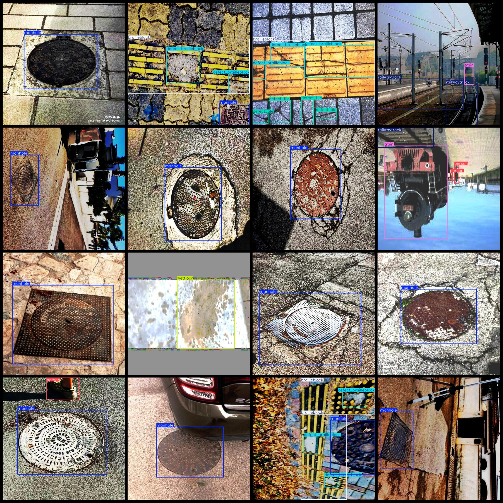
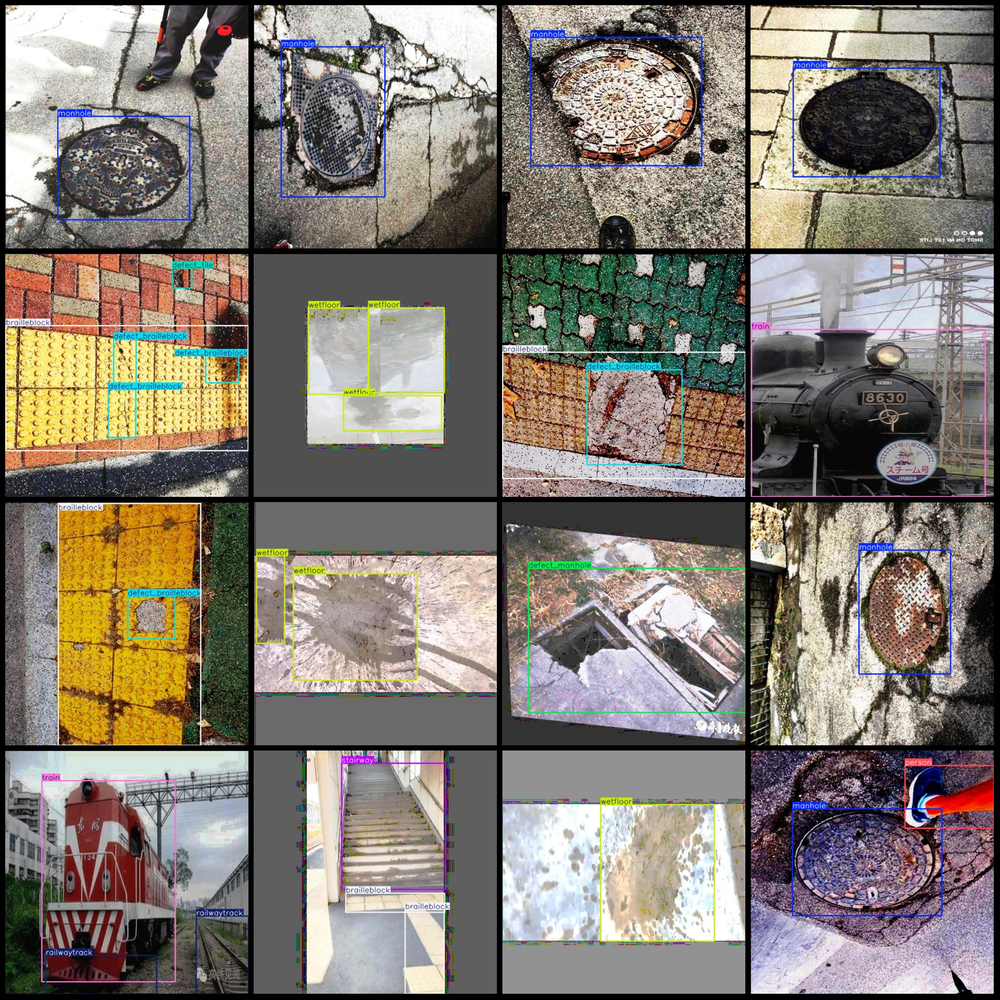

# Railway Infrastructure Defects, Blind Pits, and Road Facilities Inspection Data Set - VOC+YOLO Format - 2039 Images in 13 Categories

Dataset format: Pascal VOC format + YOLO format (txt files without split paths, only containing jpg images and corresponding VOC format xml files and YOLO format txt files)
Number of images (jpg file count): 2039
Number of annotations (xml file count): 2039
Number of annotations (txt file count): 2039
Number of annotation categories: 13
Annotation category names (note that the order in the YOLO format does not correspond with this, but is based on the labels folder 'classes.txt'): ['bench', 'bollard', 'brailleblock', 'defect_bollard', 'defect_brailleblock', 'defect_manhole', 'defect_tile', 'manhole', 'person', 'railwaytrack']
"stairway","train","wetfloor"]  
The number of bounding boxes labeled in each category:
Bench (long bench) Frame Count = 36
Number of bollards = 270
Brailleblock (blind path brick) frame count = 550
Defect Bollard (Broken Bollard) box count = 28
Defective Braille Block (Broken Braille Block) box count = 712
Defect manhole (broken manhole) box count = 142
Defect tile (defective slab) box count = 48
Manhole (box) count = 985
person box count = 373
railwaytrack box count = 638
The stairs are numbered from 1 to 32.
The train box count is 416.
"Wetfloor" is a term used to describe a surface that is slippery due to moisture or wetness. The number "430" does not have a clear meaning in the context of "wetfloor".
Total frame count: 4660
Number of images per category:
Bench (Long Seat) has 33 pictures.
The number of bollard images is 31.
BrailleBlock (Blind Path Block) has a total of 452 images.
Defect Bollard (Broken Anti-collision Column) has 28 images.
Defect Braille Block (Broken Braille Block) occupies a picture count = 335.
defect_manhole(images = 142)
defect_tile(images = 23)
manhole(images = 971)
person(images = 135)
railwaytrack
26
The number of images for the train (train) is 341.
The image of "wetfloor" has a resolution of 212x212 pixels.
image resolution: 640x640  
Use the annotation tool: labelImg.
Rule: Mark the category with a rectangle.
Important note: The dataset does not have separate training, validation, and testing sets.
Special statement: This dataset does not guarantee the accuracy of the trained model or weight file.
Image Preview:
## Images

Here is a pay link on Stripe ( https://buy.stripe.com/3cs8yP7sY87d0vu9AB ). Please contact me lonlonago@foxmail.com after funding $89, and I will send you a complete data files , thank you!

